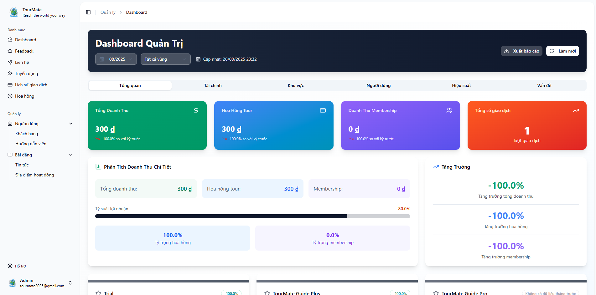
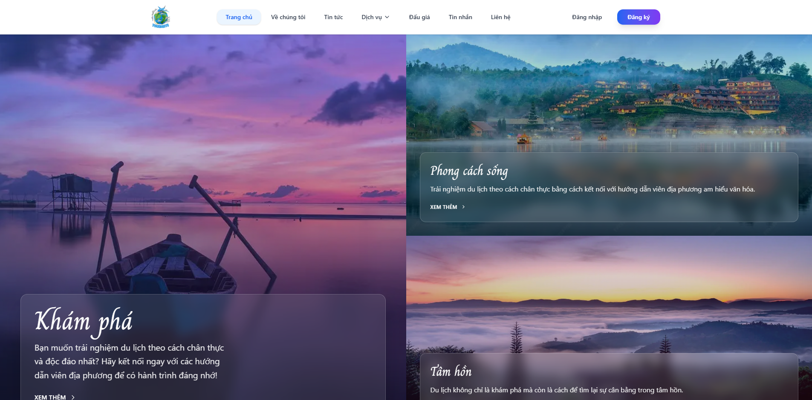

# 🌟 TourMate - Tour Guide Connection Platform

[](https://dotnet.microsoft.com/)
[](https://nextjs.org/)
[](https://www.typescriptlang.org/)
[](LICENSE)

TourMate is a modern web platform that connects travelers with local tour guides, creating unique and personalized travel experiences.

## 📸 Demo Screenshots


*Admin dashboard with comprehensive statistics*


*Intuitive and user-friendly tour booking interface*

## 🚀 Key Features

### 👥 For Travelers
- **Find tour guides**: Filter by area, ratings, experience
- **Book personalized tours**: Create custom itineraries based on personal needs
- **Secure payments**: Integrated VNPay and PayOS payment gateways
- **Real-time chat**: Direct communication with tour guides
- **Reviews and ratings**: Share experiences after trips

### 🎯 For Tour Guides
- **Profile management**: Showcase skills and experience
- **Create tours**: Design diverse tour packages
- **Schedule management**: Track booked tours
- **Receive payments**: Transparent revenue sharing system
- **Membership packages**: Upgrade accounts for additional features

### 🔧 For Administrators
- **Statistics dashboard**: Financial and activity reports
- **User management**: Approve new tour guides
- **Area management**: Set up tourist destinations
- **Detailed reports**: Export Excel data for analysis

## 🏗️ System Architecture

```
┌─────────────────┐    ┌─────────────────┐    ┌─────────────────┐
│   Frontend      │    │   Backend       │    │   Database      │
│   (Next.js)     │◄──►│   (.NET 8)      │◄──►│   SQL Server    │
│                 │    │                 │    │                 │
│ • React/TypeScript│    │ • Web API       │    │ • Entity Framework│
│ • Tailwind CSS  │    │ • JWT Auth      │    │ • Code First    │
│ • Firebase Auth │    │ • SignalR       │    │                 │
└─────────────────┘    └─────────────────┘    └─────────────────┘
```

### Frontend (Next.js)
- **Framework**: Next.js 14 với App Router
- **Language**: TypeScript
- **Styling**: Tailwind CSS + Shadcn/ui
- **State Management**: TanStack Query (React Query)
- **Authentication**: Firebase Auth + Google OAuth
- **Real-time**: SignalR Client
- **Payment UI**: PayOS Checkout, VNPay

### Backend (.NET 8)
- **Framework**: ASP.NET Core Web API
- **Authentication**: JWT Bearer + Firebase Admin SDK
- **Real-time**: SignalR + Azure SignalR Service
- **Payment**: VNPay SDK, PayOS SDK
- **Email**: SMTP Email Service
- **File Storage**: Firebase Storage
- **Architecture**: Repository Pattern + Service Layer

### Database
- **Database**: SQL Server
- **ORM**: Entity Framework Core (Code First)
- **Migrations**: Automatic database schema management

## 📦 Project Structure

```
TourMate/
├── 📁 TourMateBE/                    # Backend .NET
│   ├── 📁 TourMate/                  # Web API Project
│   │   ├── 📁 Controllers/           # API Controllers
│   │   ├── 📁 Mappings/              # AutoMapper Profiles
│   │   ├── 📁 SignalRHub/            # Real-time Hubs
│   │   └── 📄 Program.cs             # Application Entry Point
│   ├── 📁 Repositories/              # Data Access Layer
│   │   ├── 📁 Context/               # Database Context
│   │   ├── 📁 Models/                # Entity Models
│   │   ├── 📁 Migrations/            # EF Migrations
│   │   └── 📁 IRepositories/         # Repository Interfaces
│   ├── 📁 Services/                  # Business Logic Layer
│   │   ├── 📁 Services/              # Service Implementations
│   │   ├── 📁 IServices/             # Service Interfaces
│   │   └── 📁 Utils/                 # Utility Classes
│   └── 📁 RemoveMembership/          # Background Worker
│
├── 📁 tourmatefe/                    # Frontend Next.js
│   ├── 📁 app/                       # App Router Pages
│   │   ├── 📁 admin/                 # Admin Dashboard
│   │   ├── 📁 api/                   # API Client Functions
│   │   ├── 📁 login/                 # Authentication Pages
│   │   ├── 📁 payment/               # Payment Pages
│   │   ├── 📁 tour-guide/            # Tour Guide Features
│   │   └── 📁 tour-service/          # Tour Booking
│   ├── 📁 components/                # Reusable Components
│   │   ├── 📁 ui/                    # Shadcn UI Components
│   │   └── 📄 *.tsx                  # Custom Components
│   ├── 📁 hooks/                     # Custom React Hooks
│   ├── 📁 lib/                       # Utility Libraries
│   ├── 📁 types/                     # TypeScript Type Definitions
│   └── 📄 firebaseConfig.ts          # Firebase Configuration
│
├── 📁 TourMateRemoveMembership/      # Membership Cleanup Service
└── 📄 docker-compose.yml            # Docker Configuration
```

## 🛠️ Installation and Setup

### System Requirements
- **Node.js**: v18+ 
- **.NET SDK**: 8.0+
- **SQL Server**: 2019+ or SQL Server Express
- **Git**: To clone repository

### 1. Clone Repository
```bash
git clone https://github.com/mineduck1608/TourMate.git
cd TourMate
```

### 2. Backend Setup (.NET)

```bash
cd TourMateBE
```

#### Database Configuration
1. Open `appsettings.json` in `TourMate/` folder
2. Update connection string:
```json
{
  "ConnectionStrings": {
    "DefaultConnection": "Server=localhost;Database=TourMateDB;Trusted_Connection=true;TrustServerCertificate=true;"
  }
}
```

#### Run Migrations
```bash
dotnet ef database update --project Repositories --startup-project TourMate
```

#### Run Backend
```bash
cd TourMate
dotnet run
```
Backend will run at: `https://localhost:5001` or `http://localhost:5000`

### 3. Frontend Setup (Next.js)

```bash
cd ../tourmatefe
npm install
```

#### Environment Variables Configuration
Create `.env.local` file:
```env
NEXT_PUBLIC_API_URL=http://localhost:5000
NEXT_PUBLIC_FIREBASE_API_KEY=your_firebase_api_key
# ... other environment variables
```

#### Run Frontend
```bash
npm run dev
```
Frontend will run at: `http://localhost:3000`

### 4. Run with Docker (Optional)

```bash
# From root directory
docker-compose up --build
```

## 🔧 Technologies Used

### Frontend Technologies
| Technology | Version | Purpose |
|-----------|-----------|----------|
| Next.js | 14.x | React Framework with App Router |
| TypeScript | 5.x | Type Safety |
| Tailwind CSS | 3.x | Styling Framework |
| Shadcn/ui | Latest | Component Library |
| TanStack Query | 5.x | Server State Management |
| Firebase | 10.x | Authentication & Storage |
| SignalR | Latest | Real-time Communication |

### Backend Technologies  
| Technology | Version | Purpose |
|-----------|-----------|----------|
| .NET | 8.0 | Backend Framework |
| Entity Framework Core | 8.x | ORM |
| JWT Bearer | Latest | Authentication |
| SignalR | Latest | Real-time Features |
| AutoMapper | Latest | Object Mapping |
| VNPay SDK | Latest | Payment Gateway |
| PayOS SDK | Latest | Payment Gateway |

### Infrastructure
- **Database**: SQL Server with Entity Framework Core
- **Cloud Services**: Azure SignalR Service
- **File Storage**: Firebase Storage
- **Payment**: VNPay, PayOS
- **Email**: SMTP Service
- **Containerization**: Docker & Docker Compose

## 📚 API Documentation

### Authentication Endpoints
```
POST /api/account/login
POST /api/account/google
POST /api/account/register
POST /api/account/request-reset-password
```

### Tour Management
```
GET /api/tour-guide
POST /api/tour-guide
PUT /api/tour-guide/{id}
DELETE /api/tour-guide/{id}
```

### Payment Processing
```
POST /api/payment
GET /api/payment/{id}
GET /api/payment/vnpay-return
```

### Admin Dashboard
```
GET /api/admin-dashboard
GET /api/admin-dashboard/financial
GET /api/admin-dashboard/users
GET /api/admin-dashboard/areas
```

## 🔐 Security

- **JWT Authentication**: Tokens with expiration time
- **Role-based Authorization**: Customer, TourGuide, Admin
- **Firebase Security**: Google OAuth integration
- **API Rate Limiting**: Anti-spam and abuse protection
- **Input Validation**: Input data verification
- **HTTPS**: Data transmission encryption

## 🧪 Testing

### Backend Testing
```bash
cd TourMateBE
dotnet test
```

### Frontend Testing
```bash
cd tourmatefe
npm test
```

## 📈 Performance

- **Frontend**: 
  - Next.js App Router cho tối ưu SEO
  - Image optimization tự động
  - Code splitting và lazy loading
  - TanStack Query cho caching

- **Backend**:
  - Entity Framework với query optimization
  - Repository pattern cho separation of concerns
  - SignalR cho real-time performance
  - Background services cho heavy tasks

## 🚀 Deployment

### Frontend (Vercel)
```bash
npm run build
# Deploy to Vercel, Netlify, or other platforms
```

### Backend (Azure/AWS)
```bash
dotnet publish -c Release -o ./publish
# Deploy to Azure App Service, AWS, or Docker containers
```

### Database
- Azure SQL Database
- AWS RDS SQL Server
- On-premise SQL Server

## 🤝 Contributing

1. Fork the project
2. Create feature branch (`git checkout -b feature/AmazingFeature`)
3. Commit changes (`git commit -m 'Add some AmazingFeature'`)
4. Push to branch (`git push origin feature/AmazingFeature`)
5. Create Pull Request

### Code Style Guidelines
- **Frontend**: ESLint + Prettier configuration
- **Backend**: .NET coding conventions
- **Database**: Consistent naming conventions

## 📄 License

This project is licensed under the [MIT License](LICENSE).

## 👥 Team

- **Frontend Developer**: User interface development
- **Backend Developer**: API and business logic development  
- **DevOps Engineer**: Deployment and infrastructure management
- **UI/UX Designer**: User experience design

## 📞 Contact

- **Email**: support@tourmate.com
- **Website**: https://tourmate.com
- **GitHub**: https://github.com/mineduck1608/TourMate

## 🔄 Roadmap

### Q1 2025
- [ ] Mobile app (React Native)
- [ ] Multi-language support
- [ ] Advanced search filters

### Q2 2025  
- [ ] AI-powered tour recommendations
- [ ] Video call integration
- [ ] Loyalty program

### Q3 2025
- [ ] Blockchain payment integration
- [ ] Advanced analytics dashboard
- [ ] Tour guide certification system

---

⭐ **If this project is helpful, please give us a star!** ⭐
